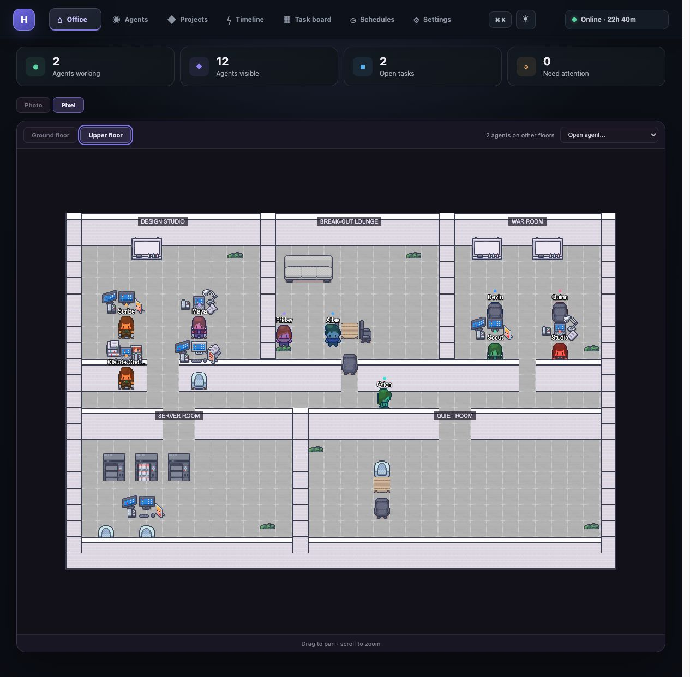

# Hermes Live Agent Hub

> I built this because I wanted one place to see what my local agent team was actually doing, without jumping between terminals, databases and log files.


| Photo office | Pixel office |
|:--:|:--:|
|  |  |
| The detailed office I use day to day. | A lighter, game-like view with two floors, walking agents, pan and zoom. |

## What it is

Hermes Live Agent Hub is a local dashboard for Hermes and the other coding agents running on my Mac. It turns their real state into an office instead of pretending every open session is busy.

Working agents sit in the department that matches their task. Queued or blocked work moves to the Meeting Room, idle agents head upstairs, and Friday stays available to coordinate the team. Clicking an agent opens the task, current status, recent activity and any linked conversation history I have locally.

The Photo view is still the default. Pixel mode is optional and lazy-loads Phaser only when I switch to it, so the normal dashboard does not pay for the game engine.

## What I use it for

- Seeing who is genuinely working, queued, waiting, idle or stuck
- Checking task-stage progress without made-up time estimates
- Following projects across Backlog, In progress, Review, Completed and Archive
- Opening Project Rooms with their tasks, progress and assigned team
- Replaying real task history and watching agents move through past departments
- Reading recent local conversation history from an agent profile
- Spotting failures, stale workers and gateway problems quickly
- Finding agents, projects, tasks or views with `⌘K`
- Keeping Claude Code, Codex and OpenClaw sessions in the same roster as Hermes agents
- Switching between Midnight, Daylight and Botanical themes or using the office full screen

There are desktop alerts too, but they are opt-in. I only use them for work entering review, completing, becoming blocked or failing.

## What “live” means

The green Online badge means the Hub is connected to local Hermes data. It does not mean every assigned card has a running worker.

An agent is shown as working only when Hermes has a running task, a live worker PID and a recent heartbeat. Assigned work without a worker is queued, while blocked or stale work is surfaced for attention. Progress bars show verified workflow stages such as queued, running, paused, review and complete. The shimmer means a worker is alive; it is not a fake percentage based on elapsed time.

Friday is handled from recent session messages rather than old unclosed session records, so she returns to idle when the conversation has actually gone quiet.

## How it works

```text
Hermes local state (~/.hermes)
Claude Code / Codex / OpenClaw sessions
                │
                ▼
        FastAPI local adapter
                │
        JSON + server-sent events
                │
                ▼
          React office UI
          ├── Photo view
          └── Pixel view (Phaser)
```

The backend reads local SQLite, JSON and session files. It merges the legacy Hermes Kanban database with project boards under `~/.hermes/kanban/boards/`, scans agent profiles automatically and streams live updates to the browser.

The only Hub-owned configuration file on disk is `~/.config/hermes-agent-hub/settings.json`. The browser also remembers small UI choices such as the theme and office view. From the Settings page I can disable a source, point it at a different state directory or adjust its activity window.

## Run it locally

You will need Python 3.11+ and Node.js 18+.

```bash
git clone https://github.com/Sophie97x/Hermes-Live-Agent-Hub.git
cd Hermes-Live-Agent-Hub/frontend
npm install
npm run build

cd ../backend
python -m venv .venv
source .venv/bin/activate
pip install -r requirements.txt
python -m uvicorn main:app --host 127.0.0.1 --port 3001
```

Open [http://localhost:3001](http://localhost:3001). The FastAPI process serves both the API and the built frontend.

By default the Hub reads Hermes from `~/.hermes`. The main local paths can be overridden when needed:

```bash
HERMES_HOME=/path/to/.hermes \
OBSIDIAN_PROJECTS=/path/to/obsidian/projects \
python -m uvicorn main:app --host 127.0.0.1 --port 3001
```

For frontend work:

```bash
cd frontend
npm run dev      # Vite on port 5174
npm test
npm run lint
```

## Project layout

```text
backend/                  FastAPI app and local-state readers
frontend/                 React/Vite interface
frontend/src/components/  Office, board, timeline and settings views
frontend/src/pixel/       Pixel office scene, floors and movement
docs/screenshots/         Images used in this README
```

## Privacy

The Hub does not need an API key and does not send agent data to a hosted service. Databases, environment files, build output and generated work stay local and are excluded from Git.

This is a personal project built around my own Hermes setup. I have kept the paths and agent sources configurable so somebody else can adapt it without copying my machine layout.

## Credits

The Pixel office is adapted from [SkyOffice](https://github.com/kevinshen56714/SkyOffice) by Kuan-Hsuan Shen. SkyOffice is MIT licensed; its notice is included with the Pixel assets. Original pixel art is by LimeZu: [Modern Office](https://limezu.itch.io/modernoffice) and [Modern Interiors](https://limezu.itch.io/moderninteriors).
