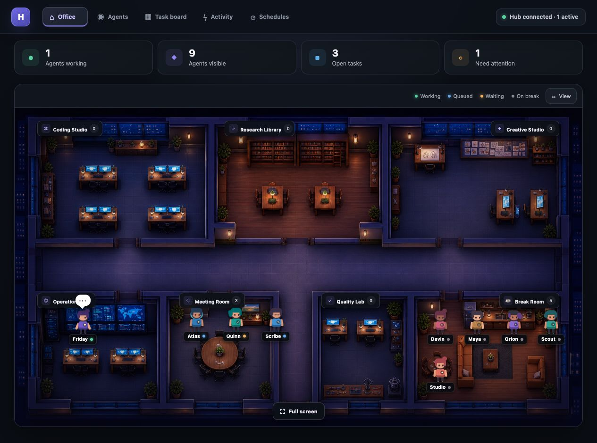
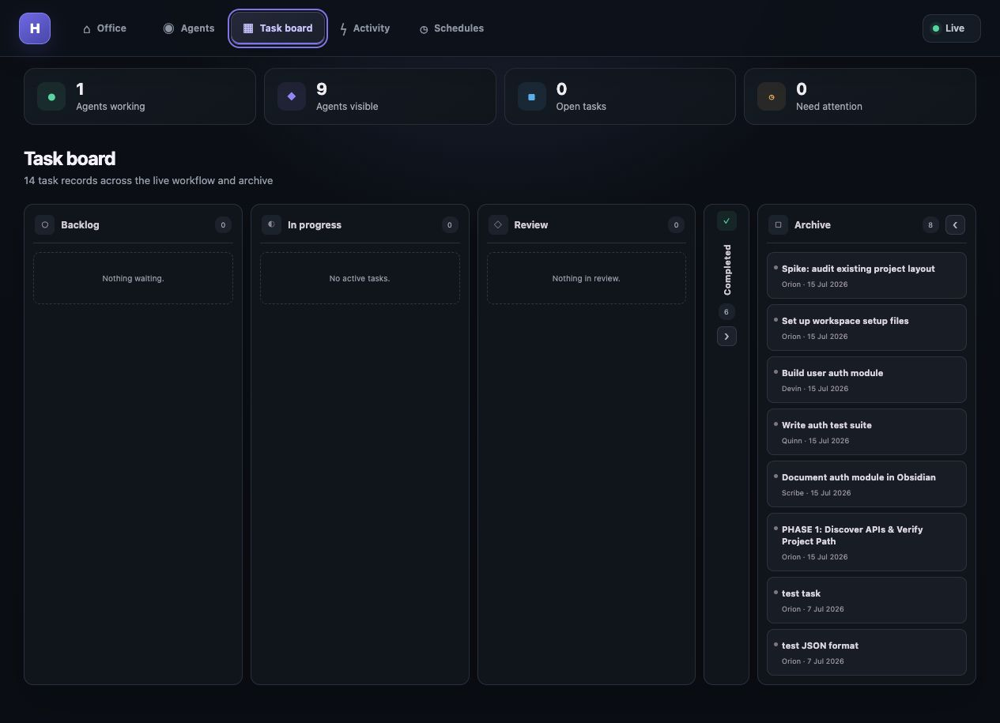

# Hermes Live Agent Hub

> A small, local-first office dashboard I built to make my Hermes agents feel like a real team rather than a list of terminal sessions.




## Why I made it

I wanted a quick way to look at Hermes and understand what the whole team was doing without digging through terminals, databases or log files. The hub turns that state into a live office: verified workers move to the department that matches their work, queued agents wait in the Meeting Room, idle agents head to the Break Room, and Friday stays in Operations coordinating the team.

It is deliberately lightweight. The characters and movement use small CSS animations, the backend reads Hermes state directly, and there is no WebGL engine or heavy UI framework running in the background.

## What it does

- Discovers new Hermes agent profiles automatically
- Shows verified working, queued, waiting, failed and idle states in a live office
- Routes agents between seven departments based on their current task
- Keeps idle agents together in the Break Room
- Opens agent profiles and readable speech bubbles on click
- Shows backlog, active, review, completed and archived work
- Remembers whether Completed and Archive are minimized
- Includes Midnight, Daylight and Botanical office themes
- Supports a clutter-free full-screen office view
- Uses server-sent events for live updates and pauses background polling when the tab is hidden

## What “live” means

The green connection badge means the dashboard is connected to the local Hermes data, not that every assigned agent is running. A specialist only appears as working when Hermes has a running task, a live worker PID and a heartbeat from the last 120 seconds. Assigned cards without a worker are queued; blocked or stale work needs attention.

Friday uses real session messages rather than old unclosed session records. She remains active for five minutes after recent session activity, then returns to idle. This keeps the office useful without pretending that an old task or terminal session is still running.

## Task history

The Task Board gives me one place to see current work and the projects the team has already completed. Completed and Archive can be minimized independently, and that choice is remembered after navigating away or refreshing the page.



## How it works

```text
Hermes local state (~/.hermes)
        │
        ├── sessions and task databases
        ├── cron jobs
        └── agent profiles
                │
                ▼
        FastAPI read-only adapter
                │
                ├── JSON endpoints
                └── live server-sent events
                        │
                        ▼
                  React office UI
```

The backend reads local SQLite and JSON files without modifying them. Agent profiles are scanned from the Hermes profiles directory, so adding or removing an agent does not require editing the frontend.

## Run it locally

You will need Python 3.11+ and Node.js 18+.

```bash
git clone https://github.com/Sophie97x/Hermes-Live-Agent-Hub.git
cd Hermes-Live-Agent-Hub/frontend
npm install
npm run build

cd ../backend
python -m venv .venv
source .venv/bin/activate
pip install -r requirements.txt
python -m uvicorn main:app --host 127.0.0.1 --port 3001
```

Then open [http://localhost:3001](http://localhost:3001).

By default the hub reads Hermes state from `~/.hermes`. Both local locations can be overridden:

```bash
HERMES_HOME=/path/to/.hermes \
OBSIDIAN_PROJECTS=/path/to/obsidian/projects \
python -m uvicorn main:app --host 127.0.0.1 --port 3001
```

## Project structure

```text
backend/                  FastAPI app and local state readers
frontend/                 React and Vite interface
frontend/src/components/  Office, Task Board, Activity and Schedule views
docs/screenshots/         Screenshots used in this README
```

## Privacy

The hub does not need an API key and does not send Hermes data to a hosted service. Local databases, environment files, build output and generated working files are excluded from Git.

This is a personal project built around my own Hermes setup, but I have kept the paths configurable so it can be adapted to another local installation.
